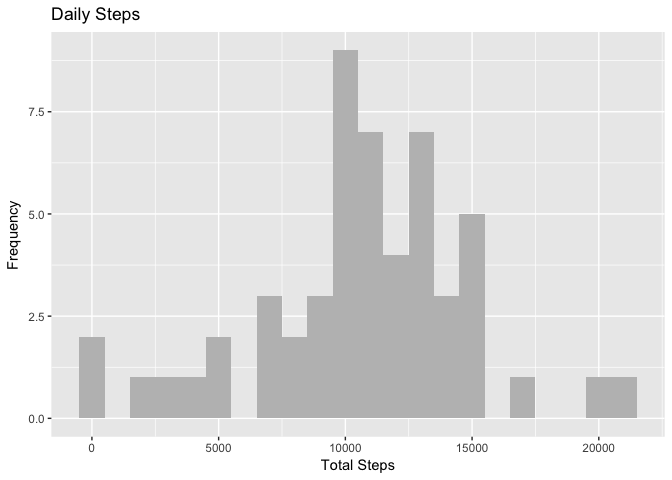
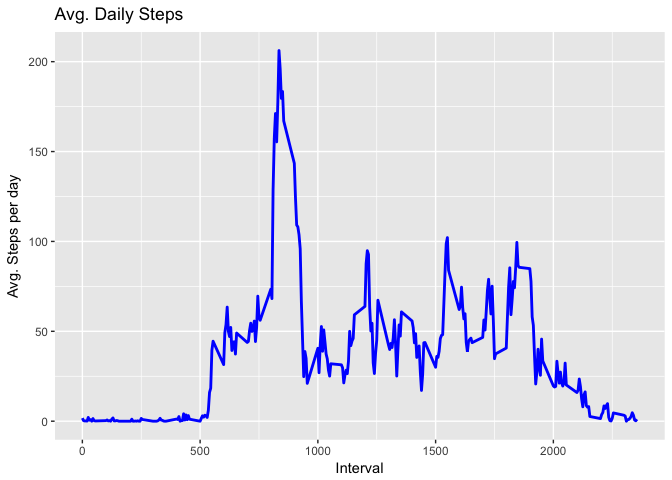
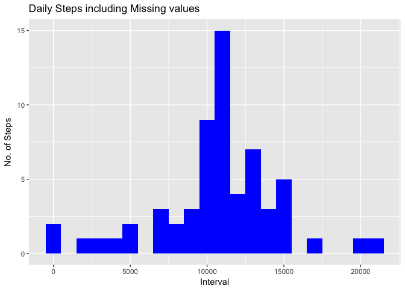
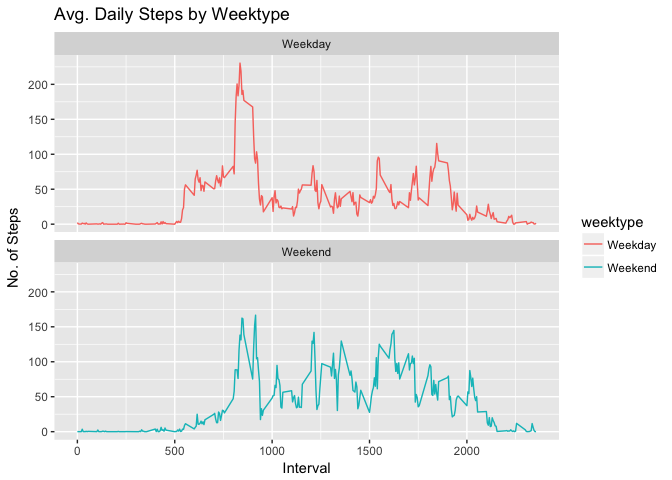

# Reproducible Research: Peer Assessment 1
## Loading and preprocessing the data

```r
activity<-read.csv("/Users/lt/Desktop/Reproducible-Research-project-1/activity.csv")
activity$date<- as.Date(activity$date)
```
## What is mean total number of steps taken per day?
1.Calculate the total number of steps taken per day:

```r
library(dplyr)
```

```
## 
## Attaching package: 'dplyr'
```

```
## The following objects are masked from 'package:stats':
## 
##     filter, lag
```

```
## The following objects are masked from 'package:base':
## 
##     intersect, setdiff, setequal, union
```

```r
Total_Steps <- activity %>%
        group_by(date) %>%
        filter(!is.na(steps)) %>%
        summarise(total_steps = sum(steps, na.rm=TRUE))
Total_Steps
```

```
## # A tibble: 53 × 2
##          date total_steps
##        <date>       <int>
## 1  2012-10-02         126
## 2  2012-10-03       11352
## 3  2012-10-04       12116
## 4  2012-10-05       13294
## 5  2012-10-06       15420
## 6  2012-10-07       11015
## 7  2012-10-09       12811
## 8  2012-10-10        9900
## 9  2012-10-11       10304
## 10 2012-10-12       17382
## # ... with 43 more rows
```
2. Make a histogram of the total number of steps taken each day

```r
library(ggplot2)

ggplot(Total_Steps, aes(x = total_steps)) +
        geom_histogram(fill = "grey", binwidth = 1000) +
        labs(title = "Daily Steps", x = "Total Steps", y = "Frequency")
```

<!-- -->
3. Calculate and report the mean and median of the total number of steps taken per day

```r
Mean_Steps<- mean(Total_Steps$total_steps, na.rm=TRUE)
Mean_Steps
```

```
## [1] 10766.19
```

```r
Median_Steps<- median(Total_Steps$total_steps, na.rm=TRUE)
Median_Steps
```

```
## [1] 10765
```

## What is the average daily activity pattern?
1. Calculating Avg. Steps

```r
Interval<- activity %>%
        group_by(interval) %>%
        filter(!is.na(steps)) %>%
        summarise(avg_steps = mean(steps, na.rm=TRUE))
Interval
```

```
## # A tibble: 288 × 2
##    interval avg_steps
##       <int>     <dbl>
## 1         0 1.7169811
## 2         5 0.3396226
## 3        10 0.1320755
## 4        15 0.1509434
## 5        20 0.0754717
## 6        25 2.0943396
## 7        30 0.5283019
## 8        35 0.8679245
## 9        40 0.0000000
## 10       45 1.4716981
## # ... with 278 more rows
```

2. Plotting Avg. Steps

```r
ggplot(Interval, aes(x =interval , y=avg_steps)) +
        geom_line(color="blue", size=1) +
        labs(title = "Avg. Daily Steps", x = "Interval", y = "Avg. Steps per day")
```

<!-- -->

3.Which 5-minute interval, on average across all the days in the dataset, contains the maximum number of steps?

```r
Interval[which.max(Interval$avg_steps),]
```

```
## # A tibble: 1 × 2
##   interval avg_steps
##      <int>     <dbl>
## 1      835  206.1698
```

## Imputing missing values
1. Calculate and report the total number of missing values in the dataset 

```r
sum(is.na(activity$steps))
```

```
## [1] 2304
```

2. filling in all of the missing values in the dataset and create a new dataset with the missing data filled in. 

```r
activity2<- activity
nas<- is.na(activity2$steps)
avg_interval<- tapply(activity2$steps, activity2$interval, mean, na.rm=TRUE, simplify = TRUE)
activity2$steps[nas] <- avg_interval[as.character(activity2$interval[nas])]
sum(is.na(activity2))
```

```
## [1] 0
```

3. Make a histogram of the total number of steps taken each day and Calculate and report the mean and median total number of steps taken per day. 

```r
Total_Steps2<- activity2%>%
        group_by(date)%>%
        summarise(total_steps = sum(steps, na.rm=TRUE))
Total_Steps2
```

```
## # A tibble: 61 × 2
##          date total_steps
##        <date>       <dbl>
## 1  2012-10-01    10766.19
## 2  2012-10-02      126.00
## 3  2012-10-03    11352.00
## 4  2012-10-04    12116.00
## 5  2012-10-05    13294.00
## 6  2012-10-06    15420.00
## 7  2012-10-07    11015.00
## 8  2012-10-08    10766.19
## 9  2012-10-09    12811.00
## 10 2012-10-10     9900.00
## # ... with 51 more rows
```

```r
ggplot(Total_Steps2, aes(x = total_steps)) +
        geom_histogram(fill = "blue", binwidth = 1000) +
        labs(title = "Daily Steps including Missing values", x = "Interval", y = "No. of Steps")
```

<!-- -->
4. Do these values differ from the estimates from the first part of the assignment? What is the impact of imputing missing data on the estimates of the total daily number of steps?

```r
Mean_Steps2<- mean(Total_Steps2$total_steps, na.rm=TRUE)
Mean_Steps2
```

```
## [1] 10766.19
```

```r
Median_Steps2<- median(Total_Steps2$total_steps, na.rm=TRUE)
Median_Steps2
```

```
## [1] 10766.19
```
## Are there differences in activity patterns between weekdays and weekends?

```r
activity2<- activity2 %>%
        mutate(weektype=ifelse(weekdays(activity2$date)=="Saturday" | weekdays(activity2$date)=="Sunday", "Weekend", "Weekday"))

Interval2<- activity2%>%
        group_by(interval, weektype)%>%
        summarise(avg_steps2 = mean(steps, na.rm=TRUE))
ggplot(Interval2, aes(x =interval , y=avg_steps2, color=weektype)) +
       geom_line() +
       labs(title = "Avg. Daily Steps by Weektype", x = "Interval", y = "No. of Steps") +
       facet_wrap(~weektype, ncol = 1, nrow=2)
```

<!-- -->
